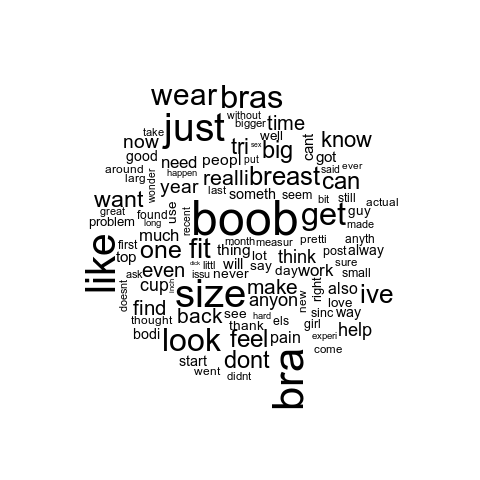
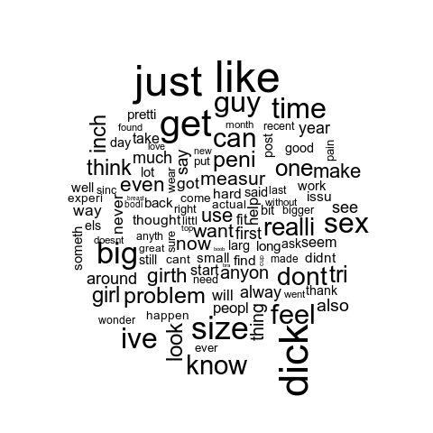
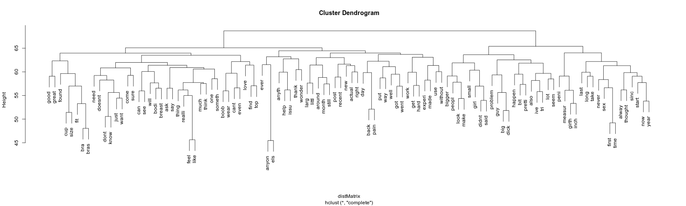
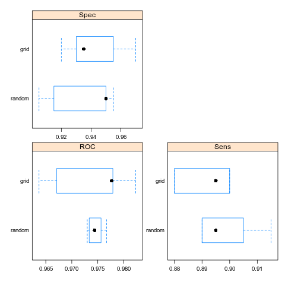

## Table of Contents

1. [Project Objective](#project-objective)  
2. [Data Source](#data-source)
3. [Data Visualisation](#data-visualisation)  
	3.1 [Data Loading and Preprocessing in R](#data-loading-and-preprocessing-in-r)  
	3.2 [Some Preliminary Patterns](#some-preliminary-patterns)  
4. [Building Models](#building-models)  
	4.1 [Baseline and Model Parameters](#baseline-and-model-parameters)  
	4.2 [Model Definitions and Training](#model-definition-and-training)  
	4.3 [Performance Comparison](#performance-comparison)
5. [Deep Learning](#deep-learning)  
	5.1 [Model Definition](#model-definition)  
	5.2 [Performance Evaluation](#performance-evaluation)
6. [Final Evaluation](#final-evaluation)

## Project Objective

This project was completed as a class project at UPV-EHU in AY 2018-2019. The project directives were to solve some sort of NLP Problem using Machine Learning in R.

With this project, I aimed to work on a classification algorithm to seperate posts into one of the two subreddits. Notice that this was already part of a Kaggle Challenge, where they required the classfication between 1013 subreddits. Another reason for selecting the data was a psychological investigation. For me, the problems in the two subreddits should have been considerably different, as confirmed by the word cloud for the subreddits.

## Data Source

The following data was taken from the Kaggle website [here](https://www.kaggle.com/mswarbrickjones/reddit-selfposts) and contains the questions asked in 1013 different subreddits, each subreddit containing 1000 questions. The data is arranged in a tsv format in the original downloadable format, with each of the two documents containing fields, as explained in the landing page as mentioned above.

After having downloaded the data, it's not possible for us to use it as such for our classification algorithms. As such, we use a python file to seperate the data content. The python program reads the subreddit of the question, and creates a document with name as the question id field, saving the text file containing the question into the directory of associated subreddit folder. This way, we get 1013 folders, each named for a subreddit, and each folder in turn containing a 1000 documents with 1 question per document.

The python file takes 2 arguments, `-r` argument is for the `rspct.tsv` file (the main dataset file) `-i` argument takes as input the csv file on `subreddit_info.csv`. The second file contains subreddits not used in the main dataset file, and so it's used to identify only the list of subreddits, that were used in the main dataset, and vice-versa. The python file can be run as following:  

```python3 to_txt.py -r rspct.tsv -i subreddit_info.csv```

## Data Visualisation

### Data Loading and Preprocessing in R

We start by loading the data, in form of corpus for two subreddits- "bigboobproblems" and "bigdickproblems". The choice of these two subreddits is because of two reasons:

1. It's interesting to know how the different sexes talk about the problems with respect to their lives, when spurting overgrowth of genitals.
2. Since the problems are expected to be different (preliminary assumption), removing all the function words should offer a very interesting insight which the model should be able to train on rather easily.

We load the documents from two subreddits in the corpus format using `VCorpus()` function, offered by "tm" library. Note that this function might not be available for all versions of R. In such case, the exercise is left to reader about to how to import the documents in corpus format (a simple StackOverflow search should direct the reader to the necessary function in R). After loading the corpora separately, we need to combine them as one, concatenating them to form one corpus of 2000 documents. The following code snippet illustrates the process:

```R
library(tm)
bigboob = VCorpus(DirSource("text_files/bigboobproblems/"), readerControl = list(language="en"))
bigdick = VCorpus(DirSource("text_files/bigdickproblems/"), readerControl = list(language="en"))
both = c(bigboob, bigdick)
```

Next, we start performing the usual needed pre-processing of the data. This involves the techniques like removing numbers, removing punctuations, lowercasing, removing stopwords, removing whitespace. The `tm_map()` function offers these pre-processing techniques in form of pre-defined methods. Here's how we do this in our code-

```R
both.trans = tm_map(both, removeNumbers)
both.trans = tm_map(both.trans, removePunctuation)
both.trans = tm_map(both.trans, content_transformer(tolower))
both.trans = tm_map(both.trans, removeWords, stopwords("english"))
both.trans = tm_map(both.trans, stripWhitespace)
both.trans = tm_map(both.trans, stemDocument)
```

Next, we decide on removing the terms with a sparsity count threshold. This is necessary since all the words we see in the documents might not be needed, and as the number of words remain higher, the vector size increases. However, this process can't be done in the Corpus format object, and we need to convert it into a `DocumentTermMatrix` objectt, following which we can call `removeSparseTerms()` method to remove the sparse values. Of course, the value of `sparse` parameter needs to be determined with hit and trial, to see what works the best. Since our data is not particularly large, let's keep it as 0.90. 

```R
both.dtm = DocumentTermMatrix(both.trans)
both.dtm.90 = removeSparseTerms(both.dtm, sparse = 0.90)
```

Next, we need to add in a column called "type" that should contain the true class of these documents. Notice that this change cannot be done with the current data format, and requires a conversion into a dataframe object. However, the `DocumentTermMatrix` can not be directly converted into a dataframe, we need to convert it into a matrix first, and then subsequently into a dataframe. We then define a column containing the first 1000 entries as class "boob" and the next 1000 as class "dick". The following snippet achieves that in form of nested commands:

``` R
data = data.frame(as.matrix(both.dtm.90))
type = c(rep("boob",1000),rep("dick",1000))
```

We have just defined the column called "type" but not yet connected it to our data. We can do it by using `cbind()` function. Also, we will need to save this data in arff format, so it can be picked up later as such, without requiring all the pipeline done so far to be repeated. This can be done by using `write.arff()` method. The following code snippet demonstrates how to achieve this:

``` R
working = cbind(both.dtm.90, type)
write.arff(cbind(data,type),file = "tdf-weka.arff")
```

### Some Preliminary Patterns

We can sort the terms from the `DocumentTermMatrix` in the order of their decreasing frequency. However, we need to make sure that we are doing it after converting it into form of a matrix. Next, we need the library "wordcloud" to build a wordcloud of the terms in each subreddit. A wordcloud shows the words in the order of their frequency. A larger font implies a more frequent word. Also, in the snippet that follows shortly, we use `png()` function to store the developed plot into a png, and to make sure the engine stops capturing the output, turn it off with `dev.off()` function. Here's the code snippet to do it, followed by the wordclouds generated:

```R
library(wordcloud)
wordFreqs_boobs = sort(colSums(as.matrix(both.dtm.90)[1:1000,]),decreasing = TRUE)
png("boob.png")
wordcloud(words = names(wordFreqs_boobs), freq = wordFreqs_boobs)
dev.off()

wordFreqs_dick = sort(colSums(as.matrix(both.dtm.90)[1001:2000,]),decreasing = TRUE)
png("dick.png")
wordcloud(words = names(wordFreqs_dick), freq = wordFreqs_dick)
dev.off()
```

  
&nbsp;&nbsp;&nbsp;&nbsp;&nbsp;&nbsp;&nbsp;&nbsp;&nbsp;&nbsp;&nbsp;&nbsp;&nbsp;&nbsp;&nbsp;&nbsp;&nbsp;&nbsp;&nbsp;&nbsp;&nbsp;Fig 1: Wordcloud for r/bigboobproblems


  
&nbsp;&nbsp;&nbsp;&nbsp;&nbsp;&nbsp;&nbsp;&nbsp;&nbsp;&nbsp;&nbsp;&nbsp;&nbsp;&nbsp;&nbsp;&nbsp;&nbsp;&nbsp;&nbsp;&nbsp;&nbsp;Fig 2: Wordcloud for r/bigdickproblems

From the generated wordclouds, we can notice a few peculiarties. However, let's make another graph called a Cluster Dendogram. The cluster dendogram shows us how the different words are clustered together in their occurrence. Notice that the first fork shows the division of documents into the 2 kinds, those belonging to either type. The following code achieves this:

```R
distMatrix=dist(t(scale(as.matrix(both.dtm.90))))
termClustering=hclust(distMatrix,method="complete")
png("cluster.png", width=1600)
plot(termClustering)
dev.off()
```

  
&nbsp;&nbsp;&nbsp;&nbsp;&nbsp;&nbsp;&nbsp;&nbsp;&nbsp;&nbsp;&nbsp;&nbsp;&nbsp;&nbsp;&nbsp;&nbsp;&nbsp;&nbsp;&nbsp;&nbsp;&nbsp;&nbsp;&nbsp;&nbsp;&nbsp;&nbsp;&nbsp;&nbsp;&nbsp;&nbsp;&nbsp;&nbsp;&nbsp;&nbsp;&nbsp;&nbsp;&nbsp;&nbsp;&nbsp;&nbsp;&nbsp;&nbsp;&nbsp;&nbsp;&nbsp;&nbsp;&nbsp;&nbsp;&nbsp;&nbsp;&nbsp;&nbsp;&nbsp;&nbsp;&nbsp;&nbsp;&nbsp;&nbsp;&nbsp;&nbsp;&nbsp;&nbsp;&nbsp;&nbsp;&nbsp;&nbsp;&nbsp;&nbsp;&nbsp;&nbsp;&nbsp;&nbsp;&nbsp;&nbsp;&nbsp;&nbsp;&nbsp;&nbsp;&nbsp;&nbsp;&nbsp;&nbsp;&nbsp;&nbsp;Fig 3: Cluster Dendogram

More about Cluster Dendograms can be understood from [here](https://www.displayr.com/what-is-dendrogram/). Looking at the generated wordclouds, we can see that there are words that are repeated often in both document classes, possibly with a relative frequency difference, but still repeated nonetheless. However, there are words that are unique to each of the clouds. Looking at the cluster dendogram, we can see that there are many distinct linkages in the two sets. As such, we can also infer that pruning the dendogram, we should be able to get clear cut classification of documents into two neat clusters. However, notice that the documents in class "boob" (on the left prong of the first division from the top), seem to diverge into two groups again quickly. This leads to believe that there is more variety within the classes as well, but more defined for the first subreddit, than the second one.

## Building Models

As of now, our working data is a `DocumentTermMatrix` type object. We need to convert it into a dataframe, so that it can be used for training the models. After doing that, we need to name our last column, so as to uniquely identify it. We call it as "type", and then split the data into 80:20 ratio for train and test sets. Note that these methods are offered by "caret" package.

The following code snippet illustrates the procedure:

``` R
library(caret)
both.matrix = as.data.frame(as.matrix(working))
colnames(both.matrix)[109]="type"
validation_index <- createDataPartition(both.matrix$type, p=0.80, list=FALSE)
training <- both.matrix[validation_index,]
testing <- both.matrix[-validation_index,]
```

### Baseline and Model Parameters

For our ML pipeline, we train 4 models to check how they perform with respect to each other. The following table gives us the model name, and the parameters associated with each model:

| S.No. | Model Name | trControl() `method` | hyper-parameter `search` type | train() `method` |
|:----------:|:----------:|:----------:|:----------:|:----------:|
| 1. | adaboost_lgocv | LGOCV | grid | adaboost |
| 2. | adaboost_lgocv_random | LGOCV | random | adaboost |
| 3. | rda_repeatedcv | repeatedcv | random | rda |
| 4. | rda_lgocv | LGOCV | random | rda |

It is worth noting that the hyper-parameter search type value of "grid" does not work well with rda based models. Before we proceed further, we need to discuss why we select these particular models, and what do they mean? Also, we need to set a baseline for our results so that we know that the model learns something at least.

For the baseline, consider a case where every instance is classified in one category. Since we are working with only 2 categories here, that would give the following as reported statistic values:

| Parameter | Baseline Value |
|:----------|:---------------|
| Accuracy | 0.50 |
| Sensitivity | 0.00 |
| Specificity | 1.00 |

This is not by any means a learned model, but rather a model that takes the simple approach of classifying everything into one category. Let us address other few important questions about the models we build. To understand some of the concepts being used in the model definitions above, please follow the links in brackets in order to understand them better. The links with explanations are as follows:

1. adaboost ([link](https://towardsdatascience.com/boosting-algorithm-adaboost-b6737a9ee60c))
2. rda ([lda](https://www.quora.com/How-does-Linear-Discriminant-Analysis-work-in-laymans-terms), [why rda over lda?](http://strimmerlab.org/courses/2005-06/seminar/slides/daniela-2x4.pdf))
3. Difference between repeatedCV and LGOCV ([StackExchange Link](https://stats.stackexchange.com/questions/17602/caret-re-sampling-methods/17610))
4. hyper-parameter tuning ([link](http://topepo.github.io/caret/random-hyperparameter-search.html))

Having understood the associated terminology, let us take a look at the training control parameters. These parameters are used to define how individual model will perform their training (`method` value), the number of folds or resampling procedures (`number`, `repeats` values), the hyper-parameter tuning option corresponding to the selected model (`search` value), whether or not to store the generated class probabilites (`classProbs` value. By default, a value > 0.5 is considered a threshold) and how the results are supposed to displayed (`summary` value). If the `verboseIter` is set as `TRUE`, it will display each step of the training regime. The following piece of code shows us how we set our parameters:

``` R
lgocv <- trainControl(method = "LGOCV",
                 number = 5,
                 search = "grid",
                 classProbs = TRUE,
                 summaryFunction = twoClassSummary,
                 verboseIter = TRUE)
repeatedcv <- trainControl(method = "repeatedcv",
                                number = 5,
                                repeats = 5,
                                classProbs = TRUE,
                                summaryFunction = twoClassSummary,
                                search = "grid",
                                verboseIter = TRUE)
lgocv_random <- trainControl(method = "LGOCV",
                      number = 5,
                      search = "random",
                      classProbs = TRUE,
                      summaryFunction = twoClassSummary,
                      verboseIter = TRUE)
repeatedcv_random <- trainControl(method = "repeatedcv",
                           number = 5,
                           repeats = 5,
                           classProbs = TRUE,
                           summaryFunction = twoClassSummary,
                           search = "random",
                           verboseIter = TRUE)
```

Having set the parameters, we start creating the models, and then use them to see their predictions on the test set we created earlier. The package caret allows us to do it by using functions `train` and `predict` to train a model, and see it's predictions, respectively. More details about the respective functions can be found [here](https://www.rdocumentation.org/packages/caret/versions/6.0-81/topics/train) and [here](https://www.rdocumentation.org/packages/raster/versions/2.8-19/topics/predict). 

### Model Definition and Training

Here are how we define our models:

``` R
# Model1: Adaboost with grid search, and LGOCV
adaboost_lgocv <- train(type ~ ., data=training, 
                             method="adaboost", 
                             metric="ROC",
                             tuneLength = 5,
                             trControl=lgocv)
predictions_adaboost_lgocv <- predict(adaboost_lgocv, newdata=testing, type="raw")
confusionMatrix(predictions_adaboost_lgocv, testing$type)
saveRDS(adaboost_lgocv, "adaboost_lgocv.model")

# Model2: Adaboost with random search, and LGOCV
adaboost_lgocv_random <- train(type ~ ., data=training, 
                        method="adaboost", 
                        metric="ROC",
                        tuneLength = 5,
                        trControl=lgocv_random)
predictions_adaboost_lgocv_random <- predict(adaboost_lgocv_random, newdata=testing, type="raw")
confusionMatrix(predictions_adaboost_lgocv_random, testing$type)
saveRDS(adaboost_lgocv_random, "adaboost_lgocv_random.model")

# Model3 : RDA with random search, and RepeatedCV
rda_repeatedcv <- train(type ~ ., data = training, 
                 method = "rda",
                 metric = "ROC",
                 tuneLength = 5,
                 trControl = repeatedcv_random)
predictions_rda_repeatedcv <- predict(rda_repeatedcv, newdata=testing, type="raw")
confusionMatrix(predictions_rda_repeatedcv, testing$type)
saveRDS(rda_repeatedcv, "rda_repeatedcv.model")

# Model4 : RDA with random search, and LGOCV
rda_lgocv <- train(type ~ ., data = training, 
                        method = "rda",
                        metric = "ROC",
                        tuneLength = 5,
                        trControl = lgocv_random)
predictions_rda_lgocv <- predict(rda_lgocv, newdata=testing, type="raw")
confusionMatrix(predictions_rda_lgocv, testing$type)
saveRDS(rda_lgocv, "rda_lgocv.model")
```

A couple of points need to be clarified here. 

1. The `metric` value is set as `ROC` in the `train()` function. This essentially specifies that the best model would be selected based on the maximal area under ROC-curve. To understand better how does that metric work, the reader is recommended to use this link [here](https://towardsdatascience.com/understanding-auc-roc-curve-68b2303cc9c5) wherein the concept is explained in a layman language, without going too-much into mathematical details, and without leaving out on the essence of the topic either. 

2. In the `predict()` function, the value of `type` is set as `raw`. The `type` parameter, by means of its `probs` value, outputs the test-probability of each sample belonging to each class (“a-posteriori” probability). On the other hand, the raw value outputs the class value with the largest probability. By means of the `raw` option the confusion matrix can be calculated: this crosses, for each test
sample, predicted with real class values.

3. Each of the models, especially using adaboost can take really long time to train. As such, it's a pain to train them again and again for each iteration. The `saveRDS()` function is used to save a n R object to be read again later, if needed. The functions takes two essential parameters, the first being the object to save, and the second as the relative address of the location where to save (relativee to working directory parameter, set by `setwd()` function before). When needed later, the object can be read from the saved file by calling the `readRDS()` function. This, while being storage capacity expensive, is still a time-saving alternative to training the entire model(s) and/or running thw whole pipeline again.

### Performance Comparison

A performance of individual models, as compared with baseline defined previously, can be summarised in form of following table:

| Model Name | Accuracy | Kappa | Sensitivity | Specificity | Final Hyper-Parameters selected |
|:----------:|:--------:|:-----:|:-----------:|:-----------:|:-------------------------------:|
| baseline | 0.5 | 0 | 0.0 | 1.0 | - |
| adaboost_lgocv | 0.925 | 0.85 | 0.9050 | 0.9450 | nIter= 200, method= Adaboost.M1 | <!-- boob, dick 181, 11, 19, 189-->
| adaboost_lgocv_random | 0.925 | 0.85 | 0.9050 | 0.9450 | nIter= 514, method= Adaboost.M1 | <!-- boob, dick 181, 11, 19, 189-->
| rda_repeatedcv | 0.5 | 0 | 0.0 | 1.0 | gamma = 0.927, lambda = 0.926 | <!-- boob, dick 0, 0, 200, 200-->
| rda_lgocv | 0.5| 0 | 0.0 | 1.0 | gamma = 0.341, lambda = 0.867 | <!-- boob, dick 0, 0, 200, 200-->

It is worth noting that the last two models perform exactly like the baseline classification. As such, the two models learn something about the data, but apparently not something of value. This can be seen  by the training regime, and especially looking at the hyper-parameters selected by the two algorithms.

For adaboost models, it is perhaps better to look at the models all together, in a graphical format to understand how they differ. This can be done by using `resamples()` method. Here's the code snippet on how to compare the models:

``` R
scales <- list(x=list(relation="free"), y=list(relation="free"))

# Compare same method models, with different search strategy
LGOCV_both <- resamples(list(grid=adaboost_lgocv, random=adaboost_lgocv_random))
png("boxplot_lgocv.png")
bwplot(LGOCV_both, scales=scales)
dev.off()
```

The `bwplot()` function creates a box-and-whiskers plot of the data, thus helping us see it more clearly. The outputs of the plots, in order of their generation, are as follows:

  
Fig 4: Box and Whiskers Plot for adaboost method with LGOCV control parameter and different hyper-parameter search methods

Details about how to read a box-plot effectively can be gathered from [here](https://www.wellbeingatschool.org.nz/information-sheet/understanding-and-interpreting-box-plots). While not very clear from the table earlier, the boxplots as above show the differences quite clearly. The dark point highlights the mean value on the distribution. Looking at the plot for Specificity, it is clear that while the mean value for `random` search method is higher than for `grid` search method, the offset is caused however, by majority of values lying below the mean in case of former as opposed to the case where the mean is almost on the lower end of the distribution. Notice that the pattern is reversed in case of the plot for Sensitivity where the mean is almost same in both the cases. Let us focus our attention on the ROC plot. While the `random` search method is fairly consistent, and produces a smaller plot, with a mean value almost near the median value, this is not the case with `grid` search method. The `grid` search method has a large variety of received results, with comparatively greater number of outliers as well. Although the mean value is comparatively higher, the distribution is very sparse. This could be explained. In grid search, the values are iterated from lower end, until a higher value is found, whereas in random search, the values are initialised at random, and then without a lot of steps in either direction, the metric is calculated. 

## Deep Learning

Having taken a look at the regular machine learning algorithms, let us now try to train a model which uses deep learning using feed-forward layers to return the output. For this effect, we would use a library provided by R, called `h2o`. The library can be installed and then loaded into the working environment by using the standard commands as follows:

``` R
install.packages("h2o")
library(h2o)
```

Before we can start working with h2o library, we need to initialise the cluster where such computations would be performed. If you have some experience with tensorflow package in python, this is similar to intialising a session in the module. The task is performed in R's h2o package with the following command:

```R
h2o.init(ip="localhost", port=1234, nthreads=1, max_mem_size = "4g")
```

The `nthreads` parameter allows us to dedicate the number of cores that would be used for the computation, with default being 2. Also, `max_mem_size` parameter allows us to set the maximum available memory that the cluster will use to store the processed data, among other things. After initialising the cluster, we continue with the saved arff format file from earlier, with the pre-processing pipeline done. This can be loaded directly by using the following command:

```R
data.hex = h2o.uploadFile("tdf-weka.arff", destination_frame = "data.hex", parse_type = "ARFF")
```

Notice how we need to specify the `destination_frame` parameter. h2o saves the data in frames, and so when we need to split this data into training and testing set, we split the frame, and extract the split frames as shown below. We again split the data in a 80:20 ratio so that the results are comparable.

``` R
hex.split = h2o.splitFrame(data=data.hex, ratios=0.80)
hex.train = hex.split[[1]]
hex.test = hex.split[[2]]
```

### Model Definition

Next, we start by defining the model. This is done by using `h2o.deeplearning()` method which offers a high number of paramters that can be chosen from. For our method, we define the model with following details:

1. No of layers = 4
2. No of neurons per layer = 100
3. activation to be used in each layer = tanh, with dropout enabled
4. Enable shuffling of training data? Yes
5. Loss computation = CrossEntropy
6. Training duration = 10 epochs
7. No of training samples to be used in each iteration = Total samples - 2
8. Metric to determine the results on = AUC (Area under curve)

The model definition is as given below. Notice that the set of trainable parameters can be viewed by typing `?h2o.deeplearning()` in R terminal.

``` R
model <- h2o.deeplearning(x=1:nrow(hex.train), y=109, training_frame = hex.train, hidden=c(100, 100, 100, 100), shuffle_training_data = TRUE, stopping_metric = "AUC", loss = "CrossEntropy", epochs=10, train_samples_per_iteration = -2, fold_assignment = "AUTO", activation="TanhWithDropout")
```

Having generated the model, we try to predict the test data, and store it in a variable as follows:

``` R
predictions_dl = h2o.predict(object = model, newdata = hex.test)
```

Also, we have to evaluate how the model performs, this needs to be done by using `h2o.performance()` method of the library in the following way, to retrieve the final output as followed after the commands.

``` R
performance_dl = h2o.performance(model, hex.test)
performance_dl
```

Final Output:

```
H2OBinomialMetrics: deeplearning

MSE:  0.2198243
RMSE:  0.4688542
LogLoss:  1.520127
Mean Per-Class Error:  0.07629538
AUC:  0.9793638
pr_auc:  0.9752801
Gini:  0.9587277

Confusion Matrix (vertical: actual; across: predicted) for F1-optimal threshold:
       'boob' 'dick'    Error     Rate
'boob'    204     13 0.059908  =13/217
'dick'     19    186 0.092683  =19/205
Totals    223    199 0.075829  =32/422

Maximum Metrics: Maximum metrics at their respective thresholds
                        metric threshold    value idx
1                       max f1  0.000044 0.920792 198
2                       max f2  0.000003 0.944808 248
3                 max f0point5  0.000182 0.944625 178
4                 max accuracy  0.000069 0.924171 192
5                max precision  0.997174 1.000000   0
6                   max recall  0.000001 1.000000 310
7              max specificity  0.997174 1.000000   0
8             max absolute_mcc  0.000069 0.849354 192
9   max min_per_class_accuracy  0.000025 0.917051 205
10 max mean_per_class_accuracy  0.000044 0.923705 198

Gains/Lift Table: Extract with `h2o.gainsLift(<model>, <data>)` or `h2o.gainsLift(<model>, valid=<T/F>, xval=<T/F>)
```

After having generated the results, don't forget to shutdown the started cluster with the following command. This will enable a prompt asking if you really want to shutdown. Enter `Y` to end the cluster session.

``` R
h2o.shutdown()
```

### Performance Evaluation

There are a lot of things that could be studied by the final output we got earlier. For the starters, we can start by looking at the various metrics that were calculated by the model. Notice that there are 2 auc values, a difference between what each of them is explained excellently in this blog post [here](http://www.chioka.in/differences-between-roc-auc-and-pr-auc/). It is worth noting that we have been working with ROC AUC so far, and so while we compare the results of the deep learning model with regular ML models, we would focus on this particular metric.

Let us work with PR-AUC first. From the link, it's clear that we stress on using PR-AUC when the number of negative examples far exceed the number of positive examples. If we take a look at the confusion matrix, we see that the algorithm worked with 223 and 199 examples from each class. This is not a significant difference, so we can work with ROC-AUC values very comfortably. Nonetheless, a high value of the metric stresses on a higher balance between precision and recall values, and thus the model doesn't just perform well, it's rather stable as well.

In the `Maximum Metrics` data, we notice the 4 columns, viz. `metric`, `threshold`, `value`, and `idx`. Notice the `value` contain the maximum value attained and is NOT the actual value obtained during the evaluation. The actual value needs to be computed from the confusion matrix obtained previously.

## Final Evaluation

To compare the models from ML (the higher performing models, i.e. the ones with adaboost), and the one from deep learning, we use the following metrics:

1. ROC-AUC
2. Precision
3. Recall
4. Accuracy

The values with the models can be summarised in a tabular format as follows:

| Model Name | Specificity | Sensitivity | Accuracy | ROC-AUC |
|:----------:|:----------:|:----------:|:----------:|:----------:|
| adaboost_lgocv | 0.9450 | 0.9050 | 0.925 | 0.8940 |
| adaboost_lgocv_random | 0.9450 | 0.9050 | 0.925 | 0.8940 |
| deep_learn | 0.9347 | 0.9148 | 0.924 | 0.9793 |

This is an interesting result. We see that while the deep learning model has a reduced specificity, as it has a higher sensitivity score. Also, while the accuracy is almost the same, the ROC-AUC metric increased significantly. While the normal ML methods do predict the actual values quite right, they are rather quick to generate false positives, while the deep learning model is more cautious about the predictions. This is rather better explained by the stark difference in ROC-AUC value, which essentially points to the same thing.
